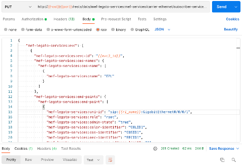

# MEF Carrier Ethernet Services using OpenDaylight UniMgr with Cisco IOS XR

## Background

A team from Xoriant, Cisco, and Amartus has been working with Ethernet Virtual Connection (EVC) based Ethernet Services based on the Lifecycle Service Orchestration (LSO) architecture defined by MEF Forum (MEF). The implementation of these services has been done within the OpenDaylight UniMgr open source project. These EVC services are offered by service providers to their clients. There are six EVC services standardized by MEF, namely Ethernet Private Line (EPL), Ethernet Virtual Private Line (EVPL), Ethernet Private LAN (EP-LAN), Ethernet Virtual Private LAN (EVP-LAN), Ethernet Private Tree (EP-Tree), and Ethernet Virtual Private Tree (EVP-Tree).

Here is a brief explanation of these services. Please also refer to [MEF 6.3] (https://www.mef.net/resources/mef-6-3-subscriber-ethernet-service-definitions/), [MEF 55.1] (https://www.mef.net/resources/mef-55-1-lifecycle-service-orchestration-lso-reference-architecture-and-framework/), and [MEF 10.4] (https://www.mef.net/resources/mef-10-4-subscriber-ethernet-services-attributes/) for additional information and the formal definition of each service.

An E-Line is a point-to-point Ethernet service that connects exactly two User Network Interface (UNI) end points. EPL and EVPL services both come under the E-Line service.


An E-LAN is a multipoint-to-multipoint Ethernet service that connects at least two UNI endpoints, and possibly several UNI endpoints. Each UNI can communicate with any other UNI that is connected to that Ethernet service. EP-LAN and EVP-LAN services both come under the E-LAN service.


An E-Tree is a rooted-multipoint ethernet service that connects at least two UNI end points, and possibly many UNI end points. The role of each UNI can be either root or leaf.  A root UNI can communicate with all other root UNIs and all leaf UNIs, whereas a leaf UNI can communicate only with all root UNIs but not with any other leaf UNI. EP-Tree and EVP-Tree services both come under the E-Tree service.


Ethernet Private services are port-based services, which means that only one such service can be provisioned on a given UNI. Ethernet Virtual Private services, on the other hand, are VLAN tag-based services, which means that multiple Ethernet Virtual Private services can be provisioned on one single UNI.

The UniMgr project implements these six services as a plugin for [OpenDaylight] (https://www.opendaylight.org/), an open source platform for customizing and automating networks of any size and scale. The services are implemented at the Legato and Presto layers as defined in Lifecycle Service Orchestration (LSO) architecture of MEF.


Legato is the topmost layer that interfaces with Operations Support Systems (OSS) / Business Support Systems (BSS), whereas Presto is an underlying layer that interacts with devices through respective drivers. The UniMgr project has provided support at Presto for several years. The team from Xorian recently contributed significant code to add support at Legato and provide important updates to Presto and the driver layer as well. This includes some validations at Legato that are over and above the validations specified in the corresponding YANG models. This ensures Legato receives absolutely valid requests and prevents rejection of equivalent API calls by the underlying Presto layer. The Presto layer has the ability to automatically determine an appropriate driver for various UNI hardware so that correct configurations are provisioned on all UNIs participating in the service. Full functionality of Create/Update/Delete/Inquire for all the six services is implemented as part of the UniMgr project. The code supports creating services on UNIs that are part of one device or that span multiple devices. 

Currently, the UniMgr project supports devices compliant with Cisco XR (ASR 9000) devices. Cisco and Xorian collaborated to upgrade this support for work with more recently version of IOS XR software. The Xorian team can easily develop drivers for devices of other vendors to enable orchestration of these six services on other devices. 

This repository provides a tutorial that can be used to try the UniMgr project for yourself. The tutorial demonstrates orchestration of these services using two Cisco XR devices running in a Cisco DevNet Sandbox. Postman is used to invoke the Legato API with the necessary parameters to provision the services. This repo includes the Postman [environment](unimgr.postman_environment.json) and [collection](./unimgr.postman_collection.json) referenced in the steps that follow. 

## Create EVC Service using Cisco XR - Step By Step

### Prerequisites

For this tutorial, you will need access to a computer on which you can the [prerequisite](https://docs.opendaylight.org/en/stable-aluminium/developer-guide/developing-apps-on-the-opendaylight-controller.html#pre-requisites) software packages and tools. You will also need access to two Cisco IOS XR devices. 

If you do not have access to two Cisco IOS XR devices, you can use those provided by the CiscoDevNet [Sandbox](https://devnetsandbox.cisco.com/RM/Diagram/Index/883f8ea6-54a1-453e-98f5-fc175a2a90de?diagramType=Topology_) for IOS XR Programmability. If you do not have access to a computer on which you can install software, you can use the Linux host included within the sandbox.

This sandbox must be reserved prior to use. You can request a reservation for up to a week. It typically takes 10-15 minutes for the sandbox to be ready once it is reserved. Once you receive the email confirming the availability of your sandbox, use the information in that email to establish the VPN required to access your sandbox.

The sandbox provides two Cisco IOS XRv 9000 devices (R1 and R2) connected back to back, plus a Linux host that acts as a development box (devbox).


### Step 1: Clone the “master” branch of “unimgr” project from the OpenDaylight repository

```
$ git clone -b master https://git.opendaylight.org/gerrit/unimgr
```

### Step 2:  Change to the “unimgr” directory and build the project

```
$ cd unimgr
$ mvn clean install
```

### Step 3: After a successful build, start unimgr

The unimgr project builds a karaf distribution that has the umimgr component as a deployed
feature. It is necessary to set a higher than default maximum heap size for the JVM when running
karaf.

$ export JAVA_MAX_MEM=2g
$ ./karaf/target/assembly/bin/karaf


The resulting log file is ./karaf/target/assembly/data/log/karaf.log.

 

### Step 4: To enable support for Ethernet Virtual Connection (EVC) services, install the following features via the OpenDaylight console
 
```
opendaylight-user@root>feature:install odl-unimgr-legato-api
opendaylight-user@root>feature:install odl-unimgr-cisco-xr-driver 
```

### Step 5: Verify OpenDaylight is running 

You can verify that OpenDaylight is running on your system with the UniMgr driver for Cisco XR devices installed and the UniMgr Legato API enabled by accessing the network topology API:

<http://localhost:8181/rests/data/network-topology?content=nonconfig> (username: admin/ password: admin)


### Step 6: Access your Cisco IOS XR devices

The remainder of this tutorial assumes you are using the devices in the CiscoDevNet Sandbox for IOS XR Programmability and have established the VPN required to access the devices.
If you are using your own devices, you will need to update the access information accordingly.

In one terminal, access R1

```
$ ssh -p 2221 admin@10.10.20.70
Password: admin
```

In another terminal, access R2
```
$ ssh -p 2231 admin@10.10.20.70
Password: admin
```

Show the interfaces and l2vpn configuration prior to configuring anything on the devices.


### Step 7: Configure network interfaces on XR devices

On R1, configure a loopback interface and enable Gigabit Ethernet 0/0/0/2 as follows:

```
RP/0/RP0/CPU0:r1#conf t              
RP/0/RP0/CPU0:r1(config)#interface gigabitEthernet 0/0/0/2   
RP/0/RP0/CPU0:r1(config-if)#no shutdown 
RP/0/RP0/CPU0:r1(config-if)#commit
RP/0/RP0/CPU0:r1(config)#interface loopback0
RP/0/RP0/CPU0:r1(config-if)#ipv4 address 100.100.100.100 255.255.255.255
RP/0/RP0/CPU0:r1(config-if)#commit
RP/0/RP0/CPU0:r1(config-if)#end          
```
On R2, configure a loopback interface and enable Gigabit Ethernet 0/0/0/2 as follows:

```
RP/0/RP0/CPU0:r2#conf t
RP/0/RP0/CPU0:r2(config)#interface gigabitEthernet 0/0/0/2
RP/0/RP0/CPU0:r2(config-if)#no shutdown 
RP/0/RP0/CPU0:r2(config-if)#commit
RP/0/RP0/CPU0:r2(config-if)#interface loopback0
RP/0/RP0/CPU0:r2(config-if)#ipv4 address 200.200.200.200 255.255.255.255
RP/0/RP0/CPU0:r2(config-if)#commit
RP/0/RP0/CPU0:r2(config-if)#end
```

Show the interfaces and l2vpn configuration after completing this configuration on the devices.


Note, you will no longer see anything for GigabitEthernet 0/0/0/2 because its configuration is empty/default. You can verify the status of all the interfaces as follows:


### Step 8: Connect to R1 and R2 using OpenDaylight’s RESTCONF API, per RFC 8040

All API calls are available as part of the Postman [environment](unimgr.postman_environment.json) and [collection](./unimgr.postman_collection.json).

#### Connect R1

PUT: http://{{host}}:{{port}}/rests/data/network-topology:network-topology/topology=topology-netconf/node={{r1_name}}

Payload: 
```
{
  "network-topology:node": [
    {
      "network-topology:node-id": "{{r1_name}}",    
      "network-topology:topology-ext:loopback-address": "{{r1_loopback}}",
      "netconf-node-topology:host" : "{{r1_host}}",
      "netconf-node-topology:port" : "{{r1_netconf_port}}",
      "netconf-node-topology:username": "{{r1_username}}",
      "netconf-node-topology:password": "{{r1_password}}",
      "netconf-node-topology:tcp-only" : "false",
      "netconf-node-topology:keepalive-delay" : "0",
      "netconf-node-topology:schema-cache-directory" : "{{r1_name}}"
      }
    ]
}
```


#### Connect R2

PUT: http://{{host}}:{{port}}/rests/data/network-topology:network-topology/topology=topology-netconf/node={{r2_name}}

Payload:
``` 
{
  "network-topology:node": [
    {
      "network-topology:node-id": "{{r2_name}}",    
      "network-topology:topology-ext:loopback-address": "{{r2_loopback}}",
      "netconf-node-topology:host" : "{{r2_host}}",
      "netconf-node-topology:port" : "{{r2_netconf_port}}",
      "netconf-node-topology:username": "{{r2_username}}",
      "netconf-node-topology:password": "{{r2_password}}",
      "netconf-node-topology:tcp-only" : "false",
      "netconf-node-topology:keepalive-delay" : "0",
      "netconf-node-topology:schema-cache-directory" : "{{r2_name}}"
      }
    ]
}
```


### Step 9: On mounting the devices successfully, each devices capabilities can be observed on network topology API

<http://localhost:8181/rests/data/network-topology?content=nonconfig> (username: admin/ password: admin)


This can also be observed using the equivalent API call via Postman. Note, that this, as with all Legato API calls, is an asynchronous operation. The response to the API call reflects the status of the change to the configuration database on OpenDaylight. It may take some time for this configuration to be successfully applied on the network devices to which OpenDaylight is connected. The following Postman request and the corresponding response are shown twice, once immediately after issuing the PUT requests to mount R1 and R2, and again 30 seconds later, after connection to each device and discovery of its capabilities has completed.

GET: http://{{host}}:{{port}}/rests/data/network-topology?content=nonconfig


The complete list of capabilities is very long and continues well beyond that shown in the screenshot. Unimgr’s cisco-xr-driver explicitly looks for 3 capabilities. If any mounted device doesn’t have these capabilities, the driver will not work appropriately.
 
- "capability": "(http://cisco.com/ns/yang/Cisco-IOS-XR-l2vpn-cfg?revision=2017-06-26)Cisco-IOS-XR-l2vpn-cfg"
- "capability": "(http://cisco.com/ns/yang/Cisco-IOS-XR-ifmgr-cfg?revision=2017-09-07)Cisco-IOS-XR-ifmgr-cfg"
- "capability": "(http://cisco.com/ns/yang/Cisco-IOS-XR-infra-policymgr-cfg?revision=2017-12-12)Cisco-IOS-XR-infra-policymgr-cfg"


### Step 10:  Create a MEF EP-Line service

Create MEF services between endpoints using the Legato API. The following API call creates an EP-Line service between R1 and R2. Gigabit Ethernet 0/0/0/2 is used on both devices.

PUT: http://{{host}}:{{port}}/rests/data/mef-legato-services:mef-services/carrier-ethernet/subscriber-services/evc={{evc3_id}}

Payload:
```
{
    "mef-legato-services:evc": [
      {
        "mef-legato-services:evc-id": "{{evc3_id}}",
        "mef-legato-services:cos-names": {
          "mef-legato-services:cos-name": [
            {
              "mef-legato-services:name": "EPL"
            }
          ]
        },
        "mef-legato-services:end-points": {
          "mef-legato-services:end-point": [
            {
              "mef-legato-services:uni-id": "sip:{{r1_name}}:GigabitEthernet0/0/0/2",
              "mef-legato-services:role": "root",
              "mef-legato-services:admin-state": "true",
              "mef-legato-services:color-identifier": "COLID1",
              "mef-legato-services:cos-identifier": "COSID1",
              "mef-legato-services:eec-identifier": "EECID1",
              "mef-legato-services:source-mac-address-limit": "1",
              "mef-legato-services:source-mac-address-limit-time-interval": "1",
              "mef-legato-services:test-meg-enabled": "false",
              "mef-legato-services:user-label": "admin",
              "mef-legato-services:subscriber-meg-mip-enabled": "false",
              "mef-legato-services:ce-vlans": {
                "mef-legato-services:ce-vlan": [
                        "301"
                ]
              },
              "ingress-bwp-per-cos": {
                "mef-legato-services:bwp-flow-per-cos": [
                  {
                    "mef-legato-services:cos-name": "Neon",
                    "envelope-id": "Rank 0",
                    "rank": "0"
                  }
                ]
              },
              "egress-bwp-per-eec": {
                "mef-legato-services:bwp-flow-per-eec": [
                  {
                    "mef-legato-services:eec-name": "EEC-Krypton",
                    "envelope-id": "Rank 0",
                    "rank": "0"
                  }
                ]
              }
            },
            {
              "mef-legato-services:uni-id": "sip:{{r2_name}}:GigabitEthernet0/0/0/2",
              "mef-legato-services:role": "root",
              "mef-legato-services:admin-state": "true",
              "mef-legato-services:color-identifier": "COLID1",
              "mef-legato-services:cos-identifier": "COSID1",
              "mef-legato-services:eec-identifier": "EECID1",
              "mef-legato-services:source-mac-address-limit": "1",
              "mef-legato-services:source-mac-address-limit-time-interval": "1",
              "mef-legato-services:test-meg-enabled": "false",
              "mef-legato-services:user-label": "admin",
              "mef-legato-services:subscriber-meg-mip-enabled": "false",
              "mef-legato-services:ce-vlans": {
                "mef-legato-services:ce-vlan": [
                        "301"
                ]
              },
              "ingress-bwp-per-cos": {
                "mef-legato-services:bwp-flow-per-cos": [
                  {
                    "mef-legato-services:cos-name": "Neon",
                    "envelope-id": "Rank 0",
                    "rank": "0"
                  }
                ]
              },
              "egress-bwp-per-eec": {
                "mef-legato-services:bwp-flow-per-eec": [
                  {
                    "mef-legato-services:eec-name": "EEC-Krypton",
                    "envelope-id": "Rank 0",
                    "rank": "0"
                  }
                ]
              }
            }
          ]
        },
        "mef-legato-services:carrier-ethernet-sls": {
          "mef-legato-services:sls-id": "SLSID1",
          "mef-legato-services:start-time": "9372-84-27T31:46:58Z",
          "mef-legato-services:cos-entries": {
            "mef-legato-services:cos-entry": [
              {
                "mef-legato-services:cos-name": "Krypton",
                "mef-legato-services:pm-entries": {
                  "mef-legato-services:pm-entry": [
                    {
                      "mef-legato-services:pm-entry-id": "68",
                      "mef-legato-services:sets-of-end-point-pairs": {
                        "mef-legato-services:set-of-end-point-pairs": [
                          {
                            "mef-legato-services:index": "0",
                            "sls-uni-exclusions": {
                              "mef-legato-services:end-point-pair": [
                                {
                                  "mef-legato-services:end-point1": "1",
                                  "mef-legato-services:end-point2": "2"
                                }
                              ]
                            }
                          }
                        ]
                      },
                      "mef-legato-services:end-point-pairs": {
                        "sls-uni-exclusions": {
                          "mef-legato-services:end-point-pair": [
                            {
                              "mef-legato-services:end-point1": "1",
                              "mef-legato-services:end-point2": "2"
                            }
                          ]
                        }
                      }
                    }
                  ]
                }
              }
            ]
          }
        },
        "mef-legato-services:connection-type": "point-to-point",
        "mef-legato-services:admin-state": "true",
        "mef-legato-services:user-label": "U4",
        "mef-legato-services:max-frame-size": "1522",
        "mef-legato-services:max-num-of-evc-end-point": "2",
        "mef-legato-services:ce-vlan-id-preservation": "false",
        "mef-legato-services:ce-vlan-pcp-preservation": "false",
        "mef-legato-services:ce-vlan-dei-preservation": "false",
        "mef-legato-services:unicast-frame-delivery": "unconditional",
        "mef-legato-services:multicast-frame-delivery": "unconditional",
        "mef-legato-services:broadcast-frame-delivery": "unconditional",
        "mef-legato-services:svc-type": "epl"
      }
    ]  
}
```



### Step 11: Verify configuration on R1 and R2

Show the interface and l2vpn configuration of both devices after the creation of the service. Note that Gigabit Ethernet 0/0/0/2 on both devices now have an mtu and l2transport configured and that l2vpn is now configured on both devices as well.


## Connect with others working on Unimgr

If you have any question or wish to contribute in UniMgr project please reach out to us at <unimgr-dev@lists.opendaylight.org>.

